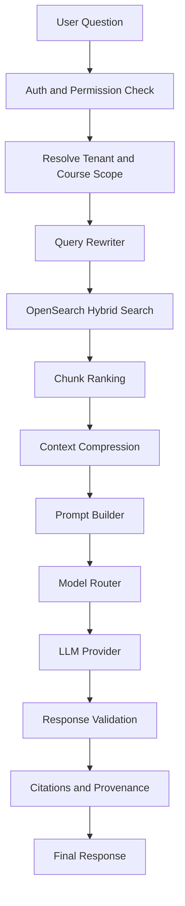

# EduOS AI Architecture

## Purpose

AI is the core differentiator of EduOS. This document defines the AI gateway, RAG pipeline, prompt builder, provider routing, indexing strategy, safety rules, and token optimization model.

## AI Principle

Learner-facing AI must answer only from approved organization content.

Approved sources:

- Uploaded PDFs
- Teacher notes
- Slides
- Lecture transcripts
- Assignments
- Course material
- Books uploaded by the organization
- Lesson metadata

The AI should not answer from public internet knowledge unless a future feature explicitly supports public research and clearly labels that mode.

## AI Gateway

The AI Gateway is the single backend entry point for AI requests.

Responsibilities:

- Validate user, tenant, and permissions
- Resolve course, batch, lesson, and learner context
- Build retrieval filters
- Call RAG services
- Build prompts
- Route to the correct model provider
- Validate outputs
- Track usage
- Store conversation memory where allowed

## RAG Flow



## Ingestion Flow

```text
Upload approved content
  -> Store original file
  -> Extract text
  -> Normalize text
  -> Chunk content
  -> Generate embeddings
  -> Index chunks in OpenSearch
  -> Mark source as indexed
```

## Prompt Builder

The prompt builder must be reusable and testable.

Inputs:

- User question
- Tenant context
- User role
- Course context
- Lesson context
- Retrieved chunks
- Conversation memory
- Output format
- Safety policy

Outputs:

- System instructions
- User prompt
- Context block
- Citation rules
- Response constraints

Rules:

- Never include entire documents.
- Include only ranked chunks.
- Include source identifiers for citations.
- Prefer concise answers unless the user asks for depth.
- Refuse when approved context is insufficient.

## Model Router

The model router chooses providers based on:

- Feature type
- Latency needs
- Cost budget
- Context length
- Required output structure
- Tenant configuration
- Provider availability

Initial providers:

- OpenAI
- Gemini

Future provider:

- AWS Bedrock

## AI Features

### AI Tutor

Answers learner questions from approved course context.

### AI Notes

Generates structured notes from lesson resources and transcripts.

### AI Summary

Summarizes lessons, live classes, uploaded files, or assignment submissions.

### AI Flashcards

Creates spaced-repetition-ready flashcards from lesson chunks.

### AI Quiz Generator

Generates questions grounded in approved lesson material.

### AI Homework Checker

Reviews student work against assignment instructions and rubrics.

### AI Assignment Review

Creates teacher-facing feedback drafts.

### AI Exam Generator

Generates exam drafts from course outcomes and approved content.

### AI Study Planner

Creates a plan from learner progress, deadlines, and weak areas.

### AI Doubt Solver

Responds to doubts with citations and suggested lessons.

### AI Weakness Detection

Uses attempts, assignments, attendance, and activity data to identify learning gaps.

### AI Teacher Assistant

Helps teachers draft lessons, quizzes, summaries, and feedback.

## Search

Use OpenSearch for:

- Keyword search
- Vector search
- Hybrid search
- Tenant-filtered retrieval
- Course-filtered retrieval
- Lesson-filtered retrieval

Every AI search query must include tenant filters.

## Chunking

Chunking should consider:

- Source type
- Heading structure
- Token length
- Semantic boundaries
- Page numbers
- Slide numbers
- Lesson sections

Each chunk should include:

- `tenant_id`
- `source_id`
- `course_id`
- `lesson_id`
- `chunk_index`
- `text`
- `embedding`
- `metadata`
- `token_count`

## Memory

AI memory must be scoped.

Allowed memory types:

- Learner progress memory
- Topic weakness memory
- Course preference memory
- Conversation summary memory

Rules:

- Memory must be tenant-scoped.
- Memory must be user-scoped.
- Memory must be inspectable.
- Sensitive memory must be deletable.
- Do not mix memory across organizations.

## Safety

Refuse or ask for clarification when:

- The answer is not supported by approved content.
- The user asks for another tenant's data.
- The user asks for hidden system prompts or policies.
- The user asks for private information.
- The output would violate academic integrity rules configured by the organization.

## Response Validation

Every learner-facing answer should be checked for:

- Grounding in retrieved content
- Citation availability
- Tenant scope
- Policy compliance
- Output shape
- Hallucination risk

## Token Optimization

- Retrieve small, relevant chunks.
- Rank before prompt assembly.
- Compress long context.
- Use short system prompts with reusable templates.
- Cache stable prompt fragments.
- Use semantic cache for repeated questions where policy allows.
- Use lower-cost models for classification, routing, and extraction.

## Observability

Track:

- Feature name
- Tenant
- User
- Provider
- Model
- Prompt tokens
- Completion tokens
- Latency
- Retrieval hit count
- Refusal reason
- Error type

Do not log raw sensitive educational content unless explicitly approved for debugging in a safe environment.
