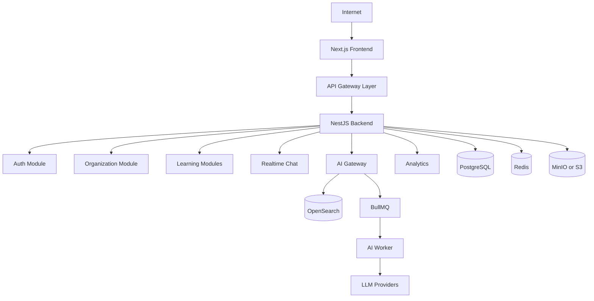
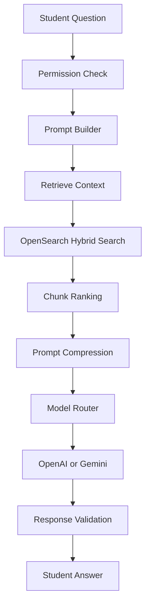

# EduOS Architecture

## Purpose

This document is the system blueprint for EduOS. It defines boundaries, data flow, service responsibilities, and implementation direction.

EduOS must be built as a modular, AI-first, multi-tenant SaaS platform. Each module should be independently understandable and designed for future extraction if scale requires it.

## System Overview



## Monorepo Boundaries

### `apps/web`

The Next.js application for learners, teachers, parents, admins, and organization owners.

Responsibilities:

- Route-level UI
- Server components where possible
- Client components for interactive workflows
- Auth-aware layouts
- Dashboard experiences
- API SDK consumption
- Realtime chat client

Non-responsibilities:

- Business rules that belong on the server
- Direct database access
- AI provider calls

### `apps/backend`

The NestJS backend.

Responsibilities:

- REST APIs under `/api/v1`
- WebSocket gateway
- Authentication
- Authorization
- Tenant resolution
- Business workflows
- Repositories
- DTO validation
- Audit logging
- OpenAPI documentation

### `apps/ai-worker`

The background worker for ingestion, embeddings, chunking, ranking, prompt preparation, and long-running AI jobs.

Responsibilities:

- Document ingestion
- Text extraction
- Chunking
- Embedding creation
- OpenSearch indexing
- AI job processing
- Async summary and quiz generation

### `packages/ui`

Shared UI primitives and application components.

### `packages/shared`

Shared runtime utilities that are safe across apps.

### `packages/sdk`

Typed client for backend APIs.

### `packages/types`

Shared TypeScript types and contracts.

### `packages/config`

Shared configuration for TypeScript, linting, formatting, environment validation, and build conventions.

### `packages/prompts`

Prompt templates, AI policies, and prompt builder assets.

## Core Flow

```text
User action
  -> Next.js route or component
  -> Typed SDK call
  -> NestJS controller
  -> Validation pipe
  -> Auth guard
  -> Tenant guard
  -> Permission guard
  -> Service
  -> Repository
  -> PostgreSQL or external system
  -> Standard response envelope
```

## Multi-Tenant Model

Tenant boundaries are mandatory.

Tenant resolution sources may include:

- Auth token claims
- Organization slug
- Custom domain
- Request header for internal service calls

Rules:

- Tenant context must be resolved before business logic.
- Tenant context must be passed into services and repositories.
- Tenant-owned tables must include `tenant_id`.
- Repositories must filter by `tenant_id` for tenant-owned records.
- Platform owner workflows must be explicit and audited.

## RBAC Model

EduOS uses permissions, not hardcoded role checks.

Flow:

```text
Authenticated user
  -> Tenant context
  -> Role assignments
  -> Permission set
  -> Permission guard
  -> Business action
```

Roles are collections of permissions. Features must check permissions such as `course.create`, `lesson.publish`, or `analytics.view`.

## Modules

### Authentication

Responsibilities:

- Email and password login
- OAuth2 login
- JWT access tokens
- Refresh token rotation
- Session tracking
- Password reset
- Account verification

### Organizations

Responsibilities:

- Tenant creation
- Organization settings
- Departments
- Domain configuration
- Branding
- Subscription state

### Users

Responsibilities:

- User profiles
- Memberships
- Role assignments
- Parent-student links
- Teacher-student visibility

### Courses

Responsibilities:

- Course metadata
- Subject mapping
- Lesson ordering
- Teacher assignment
- Batch assignment
- Publish workflow

### Lessons

Responsibilities:

- Lesson content
- Resources
- Transcripts
- Attachments
- AI-indexable metadata
- Completion tracking

### Assignments

Responsibilities:

- Assignment creation
- Submission management
- Review workflow
- Rubrics
- AI feedback drafts

### Exams

Responsibilities:

- Exam creation
- Question banks
- Attempts
- Evaluation
- Proctoring hooks later

### Attendance

Responsibilities:

- Manual attendance
- Live class attendance
- Reports
- Absence notifications

### Chat

Responsibilities:

- Room creation
- Membership
- Message persistence
- Realtime delivery
- Moderation hooks
- AI chat sessions

### Notifications

Responsibilities:

- In-app notifications
- Email hooks
- SMS hooks
- Push hooks later
- Notification preferences

### Analytics

Responsibilities:

- Engagement metrics
- Attendance metrics
- Course progress
- AI usage
- Assessment outcomes
- Weakness detection

### AI

Responsibilities:

- Prompt builder
- Retrieval
- Context assembly
- Model routing
- Response validation
- Usage tracking
- Safety enforcement

### Media

Responsibilities:

- Uploads
- Storage keys
- Signed URLs
- Virus scanning hooks
- Transcoding hooks later

### Payments

Responsibilities:

- Plans
- Subscriptions
- Invoices
- Payment provider integrations
- Entitlements

## AI Data Flow



## Deployment Direction

Development:

- Docker Compose for PostgreSQL, Redis, OpenSearch, and MinIO
- Local app processes for web, backend, and worker

Production:

- Managed PostgreSQL
- Managed Redis
- Managed OpenSearch
- S3-compatible storage
- Containerized app deployment
- CI/CD through GitHub Actions

## Architecture Rule

When adding features, update this document if a new module, boundary, dependency, or flow is introduced.
