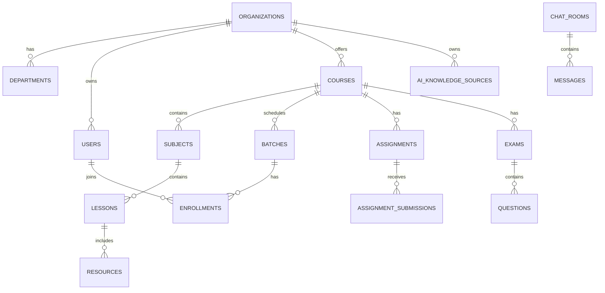

# EduOS Database Design

## Purpose

This document defines the PostgreSQL strategy for EduOS.

The database must support multi-tenancy, auditability, soft deletion, strict relationships, optimized reads, and future analytics.

## Global Rules

- Use PostgreSQL.
- Use UUID primary keys.
- Use explicit migrations.
- Never use production schema synchronization.
- Use `created_at`, `updated_at`, and `deleted_at` on persistent domain tables.
- Use `tenant_id` on tenant-owned tables.
- Use soft delete for user-facing domain data.
- Use foreign keys for integrity.
- Add indexes for tenant filters, foreign keys, slugs, status fields, and frequently sorted timestamps.
- Avoid N+1 queries.
- Keep audit logs append-only.

## Naming Conventions

- Tables use plural snake_case: `organizations`, `course_lessons`.
- Columns use snake_case: `tenant_id`, `created_at`.
- Primary key column is `id`.
- Foreign keys use `<entity>_id`.
- Enum-like fields use clear strings and database checks or application-level validation.
- Indexes use `idx_<table>_<columns>`.
- Unique indexes use `uq_<table>_<columns>`.

## Required Base Columns

Most domain tables:

```text
id uuid primary key
tenant_id uuid null or not null depending on ownership
created_at timestamptz not null
updated_at timestamptz not null
deleted_at timestamptz null
```

Audit-sensitive tables should also include:

```text
created_by uuid null
updated_by uuid null
deleted_by uuid null
```

## Multi-Tenant Rules

Tenant-owned records must always be scoped by `tenant_id`.

Examples:

- courses
- lessons
- batches
- students
- teachers
- assignments
- exams
- chat rooms
- AI knowledge base records

Platform-owned records may not need `tenant_id`.

Examples:

- global plans
- platform users
- provider metadata

## Core Entity Map



## Planned Tables

### `organizations`

Purpose: tenant root.

Key columns:

- `id`
- `name`
- `slug`
- `status`
- `plan_id`
- `settings`
- `created_at`
- `updated_at`
- `deleted_at`

Indexes:

- unique `slug`
- `status`

### `departments`

Purpose: organizational subdivision.

Key columns:

- `id`
- `tenant_id`
- `name`
- `slug`
- `description`
- timestamps

Indexes:

- `tenant_id`
- unique `tenant_id, slug`

### `users`

Purpose: platform identity and profile.

Key columns:

- `id`
- `tenant_id`
- `email`
- `name`
- `avatar_url`
- `status`
- `last_login_at`
- timestamps

Indexes:

- `tenant_id`
- unique `tenant_id, email`
- `status`

### `roles`

Purpose: named permission group per tenant.

Key columns:

- `id`
- `tenant_id`
- `name`
- `slug`
- `description`
- `is_system`
- timestamps

Indexes:

- unique `tenant_id, slug`

### `permissions`

Purpose: atomic action permission.

Key columns:

- `id`
- `key`
- `description`
- `module`

Indexes:

- unique `key`
- `module`

### `role_permissions`

Purpose: role-to-permission mapping.

Key columns:

- `role_id`
- `permission_id`
- `created_at`

Indexes:

- unique `role_id, permission_id`

### `user_roles`

Purpose: user role assignments.

Key columns:

- `tenant_id`
- `user_id`
- `role_id`
- `scope_type`
- `scope_id`
- `created_at`

Indexes:

- `tenant_id, user_id`
- `role_id`

### `courses`

Purpose: course catalog and delivery unit.

Key columns:

- `id`
- `tenant_id`
- `department_id`
- `title`
- `slug`
- `description`
- `status`
- `level`
- `published_at`
- timestamps

Indexes:

- `tenant_id`
- unique `tenant_id, slug`
- `department_id`
- `status`

### `subjects`

Purpose: course subject grouping.

Key columns:

- `id`
- `tenant_id`
- `course_id`
- `title`
- `slug`
- `position`
- timestamps

Indexes:

- `tenant_id, course_id`
- unique `tenant_id, course_id, slug`

### `lessons`

Purpose: learnable unit.

Key columns:

- `id`
- `tenant_id`
- `course_id`
- `subject_id`
- `title`
- `slug`
- `content`
- `status`
- `position`
- `published_at`
- timestamps

Indexes:

- `tenant_id, course_id`
- `tenant_id, subject_id`
- unique `tenant_id, course_id, slug`
- `status`

### `resources`

Purpose: lesson and course files.

Key columns:

- `id`
- `tenant_id`
- `course_id`
- `lesson_id`
- `type`
- `title`
- `storage_key`
- `mime_type`
- `size_bytes`
- `ai_index_status`
- timestamps

Indexes:

- `tenant_id, course_id`
- `tenant_id, lesson_id`
- `ai_index_status`

### `batches`

Purpose: scheduled cohort.

Key columns:

- `id`
- `tenant_id`
- `course_id`
- `name`
- `starts_at`
- `ends_at`
- `status`
- timestamps

Indexes:

- `tenant_id, course_id`
- `status`

### `enrollments`

Purpose: student course membership.

Key columns:

- `id`
- `tenant_id`
- `course_id`
- `batch_id`
- `student_id`
- `status`
- `enrolled_at`
- timestamps

Indexes:

- unique `tenant_id, course_id, student_id`
- `tenant_id, batch_id`
- `student_id`

### `attendance_records`

Purpose: attendance by batch, lesson, or live class.

Key columns:

- `id`
- `tenant_id`
- `student_id`
- `batch_id`
- `lesson_id`
- `live_class_id`
- `status`
- `marked_by`
- `marked_at`
- timestamps

Indexes:

- `tenant_id, student_id`
- `tenant_id, batch_id`
- `tenant_id, live_class_id`

### `assignments`

Purpose: teacher-created work.

Key columns:

- `id`
- `tenant_id`
- `course_id`
- `lesson_id`
- `title`
- `instructions`
- `due_at`
- `status`
- timestamps

Indexes:

- `tenant_id, course_id`
- `tenant_id, lesson_id`
- `due_at`
- `status`

### `assignment_submissions`

Purpose: student submissions.

Key columns:

- `id`
- `tenant_id`
- `assignment_id`
- `student_id`
- `content`
- `grade`
- `feedback`
- `submitted_at`
- `reviewed_at`
- timestamps

Indexes:

- unique `tenant_id, assignment_id, student_id`
- `tenant_id, student_id`

### `exams`

Purpose: assessment container.

Key columns:

- `id`
- `tenant_id`
- `course_id`
- `title`
- `starts_at`
- `ends_at`
- `duration_minutes`
- `status`
- timestamps

Indexes:

- `tenant_id, course_id`
- `status`

### `questions`

Purpose: question bank and exam questions.

Key columns:

- `id`
- `tenant_id`
- `exam_id`
- `type`
- `prompt`
- `options`
- `answer_key`
- `points`
- timestamps

Indexes:

- `tenant_id, exam_id`
- `type`

### `live_classes`

Purpose: live learning sessions.

Key columns:

- `id`
- `tenant_id`
- `course_id`
- `batch_id`
- `provider`
- `provider_meeting_id`
- `title`
- `starts_at`
- `ends_at`
- `recording_url`
- `status`
- timestamps

Indexes:

- `tenant_id, course_id`
- `tenant_id, batch_id`
- `starts_at`

### `chat_rooms`

Purpose: conversation containers.

Key columns:

- `id`
- `tenant_id`
- `type`
- `scope_type`
- `scope_id`
- `title`
- timestamps

Indexes:

- `tenant_id, type`
- `tenant_id, scope_type, scope_id`

### `messages`

Purpose: persisted chat messages.

Key columns:

- `id`
- `tenant_id`
- `room_id`
- `sender_id`
- `content`
- `metadata`
- `created_at`
- `deleted_at`

Indexes:

- `tenant_id, room_id, created_at`
- `sender_id`

### `notifications`

Purpose: user notification inbox.

Key columns:

- `id`
- `tenant_id`
- `user_id`
- `type`
- `title`
- `body`
- `read_at`
- `metadata`
- timestamps

Indexes:

- `tenant_id, user_id, read_at`

### `ai_knowledge_sources`

Purpose: approved AI content source.

Key columns:

- `id`
- `tenant_id`
- `course_id`
- `lesson_id`
- `resource_id`
- `source_type`
- `status`
- `checksum`
- timestamps

Indexes:

- `tenant_id, course_id`
- `tenant_id, lesson_id`
- `status`

### `ai_chunks`

Purpose: chunk metadata for retrieval.

Key columns:

- `id`
- `tenant_id`
- `knowledge_source_id`
- `chunk_index`
- `content_hash`
- `text_preview`
- `opensearch_document_id`
- `token_count`
- timestamps

Indexes:

- `tenant_id, knowledge_source_id`
- unique `knowledge_source_id, chunk_index`

### `payments`

Purpose: payment records.

Key columns:

- `id`
- `tenant_id`
- `provider`
- `provider_payment_id`
- `amount`
- `currency`
- `status`
- timestamps

Indexes:

- `tenant_id`
- `provider, provider_payment_id`

### `subscriptions`

Purpose: organization subscription state.

Key columns:

- `id`
- `tenant_id`
- `plan_id`
- `status`
- `current_period_start`
- `current_period_end`
- timestamps

Indexes:

- `tenant_id, status`

### `certificates`

Purpose: issued learner certificates.

Key columns:

- `id`
- `tenant_id`
- `course_id`
- `student_id`
- `certificate_number`
- `issued_at`
- `storage_key`
- timestamps

Indexes:

- unique `tenant_id, certificate_number`
- `tenant_id, student_id`

### `audit_logs`

Purpose: append-only sensitive action log.

Key columns:

- `id`
- `tenant_id`
- `actor_id`
- `action`
- `entity_type`
- `entity_id`
- `metadata`
- `ip_address`
- `user_agent`
- `created_at`

Indexes:

- `tenant_id, actor_id`
- `tenant_id, entity_type, entity_id`
- `created_at`

## Migration Strategy

- One migration per logical change.
- Backward-compatible changes first.
- Add nullable columns before backfilling.
- Backfill before adding `not null`.
- Add indexes concurrently where supported.
- Never drop columns in the same release that stops writing them.

## Future Work

This document should be updated before database implementation starts for each module. Every migration should trace back to a table plan here.
