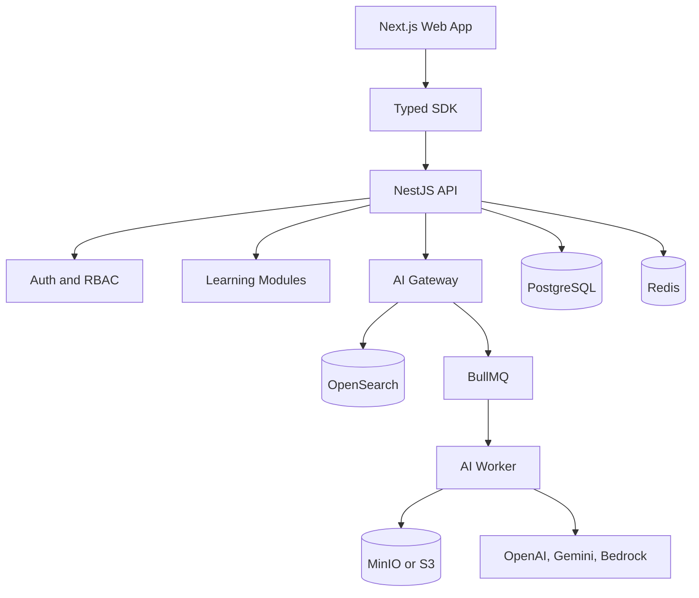

# EduOS

EduOS is an AI-powered Education Operating System for schools, coaching institutes, universities, tutors, training companies, and enterprise learning teams.

The product goal is simple: give every education organization one operating layer for administration, learning, live classes, content, analytics, and AI tutoring grounded only in approved course material.


## What We Are Building

EduOS is not just an LMS, course marketplace, video library, or generic AI chatbot.

It is a multi-tenant SaaS platform where an organization can:

- Onboard as a school, institute, university, tutor, or enterprise academy.
- Manage admins, teachers, students, parents, roles, and permissions.
- Create courses, batches, subjects, lessons, assignments, exams, and certificates.
- Run live classes, attendance, chat, notifications, and activity streams.
- Upload approved learning material such as PDFs, notes, slides, transcripts, books, and assignments.
- Let learners ask an AI Tutor that answers only from approved organization content.
- Track learning progress, weak areas, engagement, attendance, and outcomes.
- Expand later into billing, marketplace, parent portals, mobile apps, and a global education network.

## Product Direction

The long-term direction is to build the operating system behind education, from a single tutor to a large university network.

EduOS should support these user groups:

- Organization owners
- Admins and coordinators
- Teachers and assistant teachers
- Students
- Parents
- Content creators
- Platform operators

The first product milestone is a strong demo/MVP that proves the platform shape:

- Multi-tenant organization setup
- Permission-first backend
- Course operations
- AI Tutor with approved-content policy
- Live class and analytics surfaces
- Shared SDK, shared types, and modular app boundaries

## Current Status

The repository now contains the first working monorepo foundation and product demo.

## Product Vision Video

[](https://viratsoam.github.io/EduOS/)

The live demo shows the foundation we have built today. The [EduOS Product Vision Film](https://viratsoam.github.io/EduOS/) shows the complete end-to-end platform we are building: organization launch, roles and access, learning operations, grounded AI, live classrooms, and learning analytics in one connected system.

The video is intentionally framed as a product vision, not a claim that every future capability is already shipped. It can be exported locally as a 62-second WebM from [the hosted video renderer](https://viratsoam.github.io/EduOS/).

Built so far:

- Next.js web app with a product demo dashboard
- Onboarding workspace for organization setup and launch readiness
- NestJS backend scaffold under `/api/v1`
- Auth demo endpoints
- Organization onboarding demo endpoints
- Course list/create demo endpoints
- AI Tutor demo endpoint with refusal behavior when approved context is missing
- AI worker scaffold for ingestion and generation jobs
- Shared packages for UI, SDK, types, prompts, and utilities
- CI workflow for typecheck, lint, and tests

## Next Build Phases

### Phase 0: Foundation and Product Demo

Status: in progress.

Purpose: make the idea visible and runnable.

Scope:

- Monorepo setup
- Docs and architecture foundation
- Web dashboard shell
- Backend API scaffold
- AI worker scaffold
- Shared SDK and types
- Auth and organization onboarding demo

Success criteria:

- A viewer can open the app and understand what EduOS is.
- The codebase has clear module boundaries.
- The project can pass typecheck, lint, test, and build.

### Phase 1: Core Education OS

Purpose: turn the demo into a usable MVP.

Scope:

- Database-backed organizations
- Database-backed users, memberships, roles, and permissions
- Real authentication with JWT sessions
- Course creation from the UI
- Subjects, batches, lessons, and resources
- Teacher and student dashboards
- Tenant-aware repositories
- Audit-friendly API responses

Success criteria:

- An organization can onboard.
- Admins can invite users and assign roles.
- Teachers can create courses and lessons.
- Students can access assigned learning content.

### Phase 2: AI Learning Layer

Purpose: make EduOS AI-native, not AI-decorated.

Scope:

- Material upload
- Text extraction
- Chunking
- Embeddings
- OpenSearch indexing
- Retrieval-augmented AI Tutor
- Citations from approved content
- AI summaries, quizzes, flashcards, and revision notes
- Teacher assistant workflows

Success criteria:

- AI answers only from approved organization content.
- Every learner-facing AI answer has citations.
- AI refuses when approved context is missing.
- Teachers can generate learning assets from indexed material.

### Phase 3: Classroom Operations

Purpose: cover daily school/institute workflows.

Scope:

- Assignments
- Exams and quizzes
- Attendance
- Live class integrations
- Chat
- Notifications
- Calendar workflows
- Analytics dashboards

Success criteria:

- Teachers can run day-to-day classroom operations inside EduOS.
- Students can learn, ask, submit, revise, and track progress in one place.
- Admins can see institution health and engagement.

### Phase 4: Monetization and Ecosystem

Purpose: support real businesses and broader education networks.

Scope:

- Subscriptions
- Payments
- Certificates
- Parent portal
- Integrations
- Content marketplace
- Mobile apps
- Offline learning
- Voice tutor
- Whiteboard and proctoring

Success criteria:

- EduOS can serve tutors, institutes, schools, universities, and enterprises.
- The platform supports learning, operations, growth, and monetization.

## Architecture

EduOS uses a TypeScript monorepo.

```text
apps/
  web/          Next.js frontend
  backend/      NestJS API and WebSocket backend
  ai-worker/    Queue-driven AI and ingestion worker

packages/
  ui/           Shared UI primitives
  shared/       Shared runtime utilities
  sdk/          Typed API SDK
  types/        Shared TypeScript contracts
  config/       Shared config
  prompts/      Prompt templates and AI policy assets

infra/
  docker/       Local service configuration
  scripts/      Operational scripts

docs/           Additional product and engineering documentation
```

High-level flow:



## AI Safety Rule

EduOS AI must be grounded by default.

The AI Tutor should answer only from approved organization content:

- Uploaded PDFs
- Teacher notes
- Slides
- Lecture transcripts
- Assignments
- Books
- Course material
- Lesson metadata

If approved context is missing, the AI should refuse briefly and ask for more course material. It should not answer learner-facing questions from public internet knowledge.

## Tech Stack

Current implementation:

- TypeScript
- pnpm workspaces
- Next.js 15
- React 19
- TailwindCSS
- NestJS
- BullMQ
- Redis
- Shared TypeScript packages
- GitHub Actions

Planned implementation:

- PostgreSQL
- Prisma or equivalent migration layer
- JWT and refresh sessions
- OpenSearch
- MinIO locally, S3 in production
- Socket.io or native WebSocket gateway
- OpenAI, Gemini, and AWS Bedrock provider routing

## Getting Started

Install dependencies:

```bash
pnpm install
```

Run the web demo:

```bash
pnpm --filter @eduos/web dev
```

Run the backend:

```bash
pnpm --filter @eduos/backend dev
```

Run the AI worker:

```bash
pnpm --filter @eduos/ai-worker dev
```

Start local infrastructure when the database/search phase begins:

```bash
docker compose -f infra/docker/docker-compose.yml up
```

Validate the workspace:

```bash
pnpm typecheck
pnpm lint
pnpm test
pnpm build
```

## Demo Walkthrough

Open the web app and walk through:

1. Overview: institution operating layer and launch readiness.
2. Onboarding: organization setup, admin sign-in, role mapping, and AI policy readiness.
3. Courses: course operations and AI indexing state.
4. AI Tutor: grounded answer behavior with citations.
5. Live Class: attendance, questions, polls, and AI summary surface.
6. Analytics: weak-area detection and intervention planning.

## Documentation

- [MASTER_PROMPT.md](./MASTER_PROMPT.md): permanent architecture prompt for future agent work
- [TASK_PROMPT.md](./TASK_PROMPT.md): lightweight prompt for each feature request
- [ARCHITECTURE.md](./ARCHITECTURE.md): system design, module boundaries, and data flow
- [DATABASE.md](./DATABASE.md): schema rules, table plan, indexing, and migrations
- [AI.md](./AI.md): AI gateway, RAG, prompt builder, model routing, and safety rules
- [API_GUIDELINES.md](./API_GUIDELINES.md): REST, WebSocket, response, and error standards
- [CODING_STANDARDS.md](./CODING_STANDARDS.md): TypeScript, Next.js, NestJS, testing, and style rules
- [SECURITY.md](./SECURITY.md): authentication, authorization, tenant isolation, and OWASP controls
- [ROADMAP.md](./ROADMAP.md): staged product roadmap
- [CONTRIBUTING.md](./CONTRIBUTING.md): contribution workflow

## Contribution Rules

EduOS should stay modular, typed, tenant-aware, and AI-safe.

Before adding a feature:

- Read the relevant docs.
- Keep shared contracts in `packages/types`.
- Use the SDK for frontend-to-backend calls.
- Keep tenant boundaries explicit.
- Add validation at API boundaries.
- Keep AI workflows grounded in approved content.

Read [CONTRIBUTING.md](./CONTRIBUTING.md) before opening issues or pull requests.
