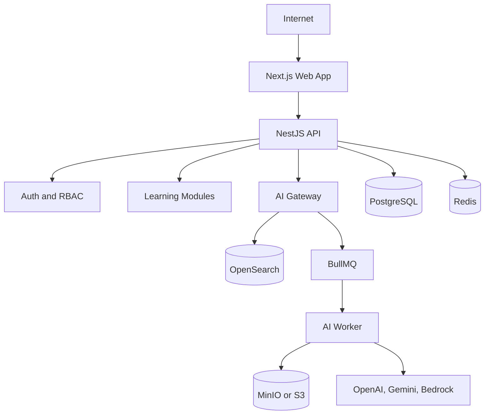

# EduOS

AI-powered Education Operating System for institutions, educators, and learners. Multi-tenant, AI-first, open, and extensible.


## Vision

EduOS is an AI-native Education Operating System for schools, universities, coaching institutes, tutors, organizations, and enterprises.

The goal is to combine institution management, learning management, live classes, collaboration, analytics, and approved-content AI tutoring into one modular platform.

EduOS is not another LMS, course marketplace, or video library. It is designed as the operating layer for modern education.

## Problem

Most education platforms solve only one slice of the work:

- Learning management systems manage courses but rarely provide strong AI learning support.
- Video platforms host content but do not manage institutions, permissions, attendance, exams, or outcomes.
- AI chat tools answer broadly from the public internet instead of approved course material.
- Schools and training organizations often stitch together separate tools for classes, content, chat, assignments, analytics, billing, and storage.

EduOS brings these workflows together with strict tenant isolation and AI that answers only from approved educational content.

## Product Principles

- AI first: every learner should have a personalized tutor grounded in approved materials.
- Multi-tenant: every organization must be isolated by design.
- API first: every capability should be available through stable APIs.
- Security first: permissions, validation, audit logs, and tenant boundaries are not optional.
- Modular: features should be independently understandable and replaceable.
- Enterprise ready: the system should scale from a tutor to a university network.

## Core Features

- Authentication and user management
- Organizations, departments, courses, batches, subjects, and lessons
- Permission-driven RBAC
- Teacher, student, parent, admin, and owner experiences
- Attendance, assignments, quizzes, exams, and certificates
- Live classes through integrations first, native WebRTC later
- Real-time chat for private, batch, course, lesson, live class, and AI conversations
- Notifications and activity streams
- Analytics for learning progress, engagement, attendance, and outcomes
- Payments, subscriptions, and marketplace capabilities in later phases

## AI Features

- AI Tutor
- AI Notes
- AI Summary
- AI Flashcards
- AI Quiz Generator
- AI Homework Checker
- AI Assignment Review
- AI Exam Generator
- AI Study Planner
- AI Doubt Solver
- AI Revision Notes
- AI Weakness Detection
- AI Learning Memory
- AI Teacher Assistant

AI must answer only from approved organization content, including uploaded PDFs, teacher notes, slides, lecture transcripts, assignments, books, course material, and lesson metadata.

## Architecture

EduOS uses a monorepo layout:

```text
apps/
  web/          Next.js frontend
  backend/      NestJS API and WebSocket backend
  ai-worker/    Queue-driven AI and ingestion worker

packages/
  ui/           Shared UI primitives
  shared/       Shared utilities
  sdk/          Typed API SDK
  types/        Shared TypeScript types
  config/       Shared lint, TypeScript, env, and build config
  prompts/      Prompt templates and AI policy assets

infra/
  docker/       Docker and local service configuration
  scripts/      Operational scripts

docs/           Additional product and engineering documentation
```

High-level flow:



## Tech Stack

Frontend:

- Next.js 15
- TypeScript
- App Router
- TailwindCSS
- Shadcn UI
- React Hook Form
- TanStack Query
- Zustand
- Socket.io Client

Backend:

- NestJS
- TypeScript
- REST APIs
- WebSocket Gateway
- BullMQ
- JWT
- OAuth2
- Passport
- Swagger and OpenAPI

Data and infrastructure:

- PostgreSQL
- Redis
- OpenSearch
- MinIO for development storage
- Amazon S3 for production storage
- Docker and Docker Compose
- GitHub Actions

AI:

- OpenAI
- Gemini
- AWS Bedrock in the future
- RAG through approved content only
- Hybrid search through OpenSearch

## Documentation

- [MASTER_PROMPT.md](./MASTER_PROMPT.md): permanent architecture prompt for future agent work
- [TASK_PROMPT.md](./TASK_PROMPT.md): lightweight prompt for each feature request
- [ARCHITECTURE.md](./ARCHITECTURE.md): system design, module boundaries, and data flow
- [DATABASE.md](./DATABASE.md): schema rules, table plan, indexing, and migrations
- [AI.md](./AI.md): AI gateway, RAG, prompt builder, model routing, and safety rules
- [API_GUIDELINES.md](./API_GUIDELINES.md): REST, WebSocket, response, and error standards
- [CODING_STANDARDS.md](./CODING_STANDARDS.md): TypeScript, Next.js, NestJS, testing, and style rules
- [SECURITY.md](./SECURITY.md): authentication, authorization, tenant isolation, and OWASP controls
- [ROADMAP.md](./ROADMAP.md): staged product roadmap
- [CONTRIBUTING.md](./CONTRIBUTING.md): contribution workflow

## Roadmap

Phase 1 focuses on the core operating system:

- Authentication
- Organizations
- RBAC
- Courses
- Lessons
- Students
- Teacher dashboard
- Student dashboard
- Live classes
- Chat
- AI Tutor
- Assignments
- Exams
- Analytics

Phase 2 adds monetization and ecosystem features:

- Payments
- Marketplace
- Subscriptions
- Certificates
- Parent portal
- Integrations

Phase 3 expands platform reach:

- Mobile apps
- Offline learning
- AI agents
- Voice tutor
- Whiteboard
- Proctoring

Phase 4 moves toward a global education network:

- Skill marketplace
- Hiring portal
- Research platform
- Global content marketplace
- University network

## Getting Started

This repository is currently in architecture setup mode. Application scaffolds will be added feature by feature using the rules in `MASTER_PROMPT.md` and `TASK_PROMPT.md`.

Expected local services:

- PostgreSQL
- Redis
- OpenSearch
- MinIO

Expected package manager:

- pnpm

## Contributing

Read [CONTRIBUTING.md](./CONTRIBUTING.md) before opening issues or pull requests.

All code must follow [CODING_STANDARDS.md](./CODING_STANDARDS.md), [SECURITY.md](./SECURITY.md), and [API_GUIDELINES.md](./API_GUIDELINES.md).

## License

MIT. See [LICENSE](./LICENSE).
